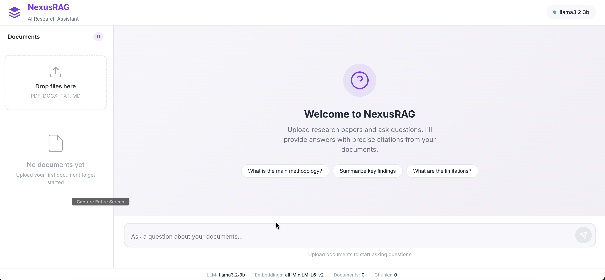

# NexusRAG

**Self-Correcting RAG for Scientific Research**

A retrieval-augmented generation system designed for scientific literature. NexusRAG reduces hallucinations through a self-correcting pipeline, provides precise citations (exact passages and page numbers), runs entirely locally via Ollama, and synthesizes insights across multiple documents.



## Demo


## How It Works

You upload research papers (PDF, DOCX, TXT, MD). NexusRAG parses and chunks them, stores embeddings in LanceDB, and builds a BM25 keyword index alongside it. When you ask a question, a hybrid retriever combines semantic search with keyword matching to find the most relevant passages. Those passages go to a local LLM (via Ollama) which generates an answer with inline citations. Before returning, a verification step checks each citation against the source — if something doesn't hold up, the system reformulates the query, re-retrieves, and tries again. The result is an answer grounded in your documents with traceable references.

## Key Features

- **Hallucination reduction** — Self-correcting retrieval loop verifies claims against source documents
- **Precise citations** — Every claim links to exact passages and page numbers
- **Local-only processing** — All data stays on your machine via Ollama (no API keys needed)
- **Cross-document synthesis** — Answers draw from and connect insights across multiple papers

## Quick Start

```bash
# Clone and install
git clone https://github.com/urme-b/NexusRAG.git
cd NexusRAG
python -m venv .venv && source .venv/bin/activate
pip install -e .

# Start Ollama (separate terminal)
ollama serve
ollama pull llama3.2:3b

# Launch NexusRAG
make run
# → http://localhost:8000
```

## Model Options

| Model | Size | RAM Required | Speed | Best For |
|-------|------|-------------|-------|----------|
| `llama3.2:3b` | 2 GB | 8 GB | Fast | Quick queries, basic summarization |
| `llama3.1:8b` | 4.9 GB | 16 GB | Moderate | Complex multi-document analysis |

Switch models by updating the configuration — see `configs/` for details.

## Tech Stack

Python · FastAPI · LanceDB · Ollama · Sentence Transformers

## System Requirements

- Python 3.11+
- 8 GB RAM minimum (16 GB recommended for larger models)
- Ollama installed and running

## Future Improvements

- [ ] Latency reduction for real-time querying
- [ ] Multimodal support (tables, figures, charts from PDFs)
- [ ] Collaborative knowledge base for research teams
- [ ] Streaming responses in the web interface
- [ ] Support for additional LLM providers beyond Ollama
- [ ] Batch ingestion with progress tracking
- [ ] Export citations in standard formats (BibTeX, APA)

## License

This project is licensed under the [MIT License](LICENSE).
