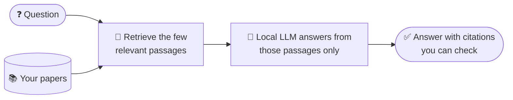
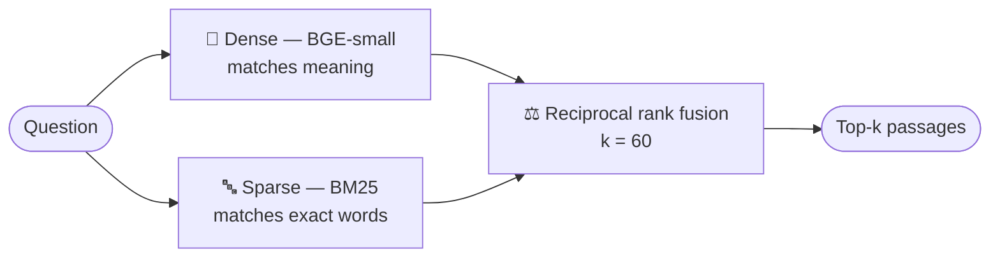
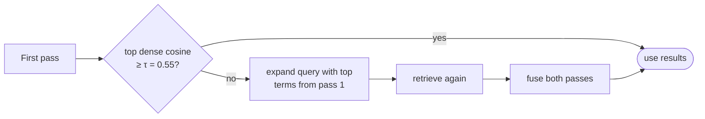
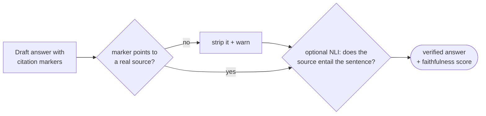
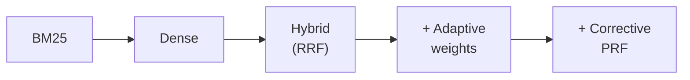
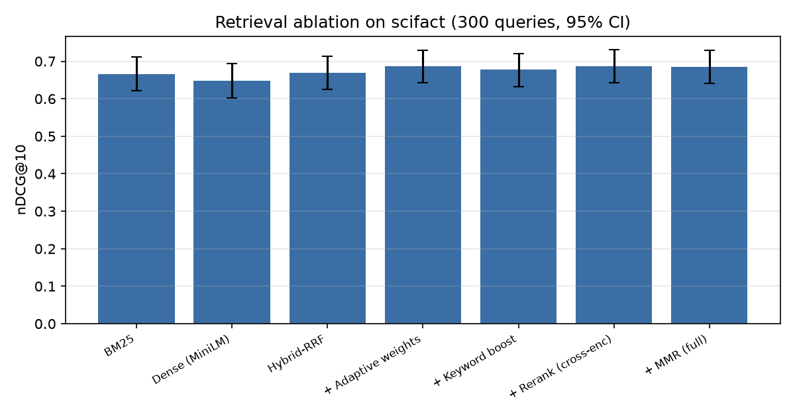
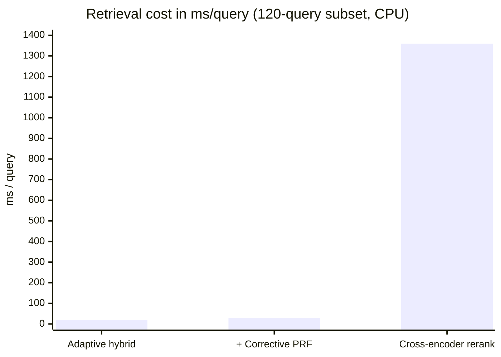
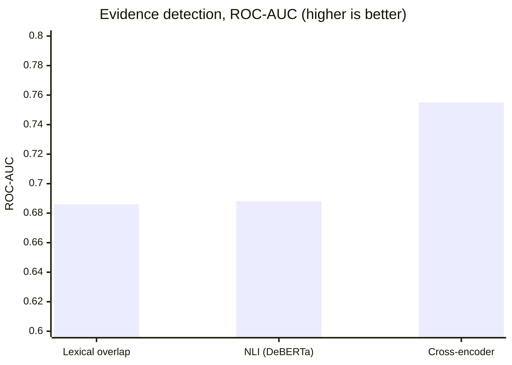
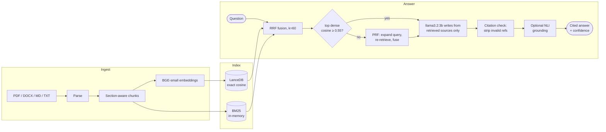

<div align="center">

# NexusRAG

**Local RAG for research papers — ask questions across your PDFs, get answers with citations you can check.**
Every component is measured on public benchmarks. CI fails the build if quality drops.

[](https://github.com/urme-b/NexusRAG/actions/workflows/ci.yml)
[](LICENSE)
[](pyproject.toml)
[](tests/)
[](tests/)
[](pyproject.toml)

[Basics](#the-basics-in-four-pictures) · [Methodology](#methodology) · [Results](#results) · [Architecture](#architecture) · [Quick start](#quick-start) · [Tech stack](#tech-stack) · [Paper](paper/main.pdf)

</div>


| 🔒 Fully local | 🧪 Measured | 🔁 Reproducible | 🚦 Gated | 🧾 Cited |
|:---:|:---:|:---:|:---:|:---:|
| Papers never leave your machine | Every component ablated on 2 BEIR datasets | `make reproduce` regenerates every number (seed 0) | CI fails if any metric drops | Every claim links to a checkable source |

## The basics, in four pictures

**1 · RAG** — don't ask the model what it remembers; retrieve first, answer from the retrieved text only:


```mermaid
flowchart LR
    Q(["❓ Question"]) --> R["🔎 Retrieve the few<br/>relevant passages"]
    K[("📚 Your papers")] --> R
    R --> G["🤖 Local LLM answers from<br/>those passages only"]
    G --> A(["✅ Answer with citations<br/>you can check"])
```

**2 · Hybrid retrieval** — two complementary signals, merged by rank position (no score calibration):


```mermaid
flowchart LR
    Q(["Question"]) --> D["🧠 Dense — BGE-small<br/>matches meaning"]
    Q --> S["🔤 Sparse — BM25<br/>matches exact words"]
    D --> F["⚖️ Reciprocal rank fusion<br/>k = 60"]
    S --> F
    F --> T(["Top-k passages"])
```

**3 · Corrective retrieval** — pay for a second pass only when the first one looks weak:


```mermaid
flowchart LR
    P1["First pass"] --> C{"top dense cosine<br/>≥ τ = 0.55?"}
    C -- yes --> OUT(["use results"])
    C -- no --> X["expand query with top<br/>terms from pass 1"] --> P2["retrieve again"] --> FU["fuse both passes"] --> OUT
```

**4 · Verification** — a citation that exists is not a citation that is true:


```mermaid
flowchart LR
    DA["Draft answer with<br/>citation markers"] --> V1{"marker points to<br/>a real source?"}
    V1 -- no --> ST["strip it + warn"] --> V2
    V1 -- yes --> V2{"optional NLI: does the<br/>source entail the sentence?"}
    V2 --> OUT(["verified answer<br/>+ faithfulness score"])
```

| Term | Meaning here |
|------|--------------|
| RAG | Retrieve relevant passages first, then generate the answer from them |
| Hybrid retrieval | Dense embeddings (meaning) + BM25 (exact words) |
| RRF | Reciprocal rank fusion — merges the two rankings by rank position |
| Corrective PRF | Low confidence → expand the query with top terms, retrieve again, fuse |
| NLI grounding | An entailment model checks each answer sentence against its cited source |
| nDCG@10 | Quality of the top-10 ranking — 1.0 is perfect, higher is better |

## Methodology

- **Strictly additive ablation** — each component is measured against the previous stack:


```mermaid
flowchart LR
    A["BM25"] --> B["Dense"] --> C["Hybrid<br/>(RRF)"] --> D["+ Adaptive<br/>weights"] --> E["+ Corrective<br/>PRF"]
```

- **Two BEIR datasets** — SciFact (300 claims / 5,183 abstracts) · NFCorpus (323 queries / 3,633 docs)
- **Deterministic** — exact search, CPU-only, seed 0; models and datasets pinned to git revisions
- **Statistics, not vibes** — bootstrap 95% CIs · paired randomization tests · Holm correction
- **Faithfulness as evidence detection** — NLI vs lexical vs cross-encoder scorers, ROC-AUC / PR-AUC
- **Regression-gated** — CI reruns a vendored sample; the build fails below committed floors
- **One-command reproduction** — `make reproduce` regenerates every number in this file

## Results

| System | SciFact nDCG@10 | NFCorpus nDCG@10 |
|--------|:---:|:---:|
| Dense — MiniLM (the common default) | 0.648 | 0.319 |
| BM25 | 0.666 | 0.312 |
| Dense — BGE-small | **0.708** | 0.342 |
| Hybrid (RRF) | 0.704 | **0.352** |
| + Corrective PRF | 0.703 | 0.346 |



**Three findings:**

- **Embedder is the biggest lever** — MiniLM → BGE-small: **+0.060** nDCG@10 (SciFact, p < 0.001)
- **Hybrid fusion beats BM25 on both datasets** — **+0.037** (SciFact, p = 0.002) · **+0.040** (NFCorpus, p < 0.001); both 95% CIs exclude zero
- **The reranker hurts here** — 0.702 vs 0.734 nDCG@10 (120-query subset) at **67×** the latency; reported, kept off by default


```mermaid
xychart-beta
    title "Retrieval cost in ms/query (120-query subset, CPU)"
    x-axis ["Adaptive hybrid", "+ Corrective PRF", "Cross-encoder rerank"]
    y-axis "ms / query" 0 --> 1400
    bar [20, 30, 1359]
```

**Faithfulness as evidence detection** (SciFact-claims dev: 188 claims, 2,031 candidate sentences, 18% positive base rate) — a plain relevance cross-encoder beats the dedicated NLI model:

| Scorer | ROC-AUC [95% CI] | PR-AUC | F1 |
|--------|:---:|:---:|:---:|
| Lexical overlap | 0.686 [0.65, 0.72] | 0.371 | 0.112 |
| NLI (DeBERTa) | 0.688 [0.65, 0.73] | 0.331 | 0.368 |
| Cross-encoder | **0.755** [0.72, 0.79] | **0.476** | **0.469** |


```mermaid
xychart-beta
    title "Evidence detection, ROC-AUC (higher is better)"
    x-axis ["Lexical overlap", "NLI (DeBERTa)", "Cross-encoder"]
    y-axis "ROC-AUC" 0.6 --> 0.8
    bar [0.686, 0.688, 0.755]
```

Full tables with CIs and p-values: [paper/main.pdf](paper/main.pdf) · raw per-query scores: [`benchmarks/results/`](benchmarks/results)

## Architecture


```mermaid
flowchart LR
    subgraph Ingest
        D["PDF / DOCX / MD / TXT"] --> P[Parse] --> C["Section-aware chunks"] --> E["BGE-small embeddings"]
    end
    subgraph Index
        V[("LanceDB<br/>exact cosine")]
        B[("BM25<br/>in-memory")]
    end
    subgraph Answer
        Q(["Question"]) --> H["RRF fusion, k=60"]
        H --> G{"top dense<br/>cosine ≥ 0.55?"}
        G -- yes --> L["llama3.2:3b writes from<br/>retrieved sources only"]
        G -- no --> F["PRF: expand query,<br/>re-retrieve, fuse"] --> L
        L --> CV["Citation check:<br/>strip invalid refs"] --> N["Optional NLI<br/>grounding"] --> A(["Cited answer<br/>+ confidence"])
    end
    E --> V
    C --> B
    V --> H
    B --> H
```

| Stage | What happens | Code |
|-------|--------------|------|
| Ingest | Parse PDF/DOCX/MD/TXT → section-aware chunks (1,200 chars, 300 overlap) → embed | [`ingestion/`](src/nexusrag/ingestion) |
| Index | Vectors in LanceDB (exact cosine) + in-memory BM25, kept in lock-step | [`storage/`](src/nexusrag/storage) |
| Retrieve | Reciprocal rank fusion (k = 60); adaptive dense/sparse weights by query shape | [`retrieval/hybrid.py`](src/nexusrag/retrieval/hybrid.py) |
| Correct | If top dense cosine < τ = 0.55: one PRF pass expands the query, re-retrieves, fuses | [`retrieval/corrective.py`](src/nexusrag/retrieval/corrective.py) |
| Generate | Local LLM answers from retrieved passages only, with inline citations | [`generation/`](src/nexusrag/generation) |
| Verify | Out-of-range citations stripped; optional per-sentence NLI entailment check | [`generation/verifier.py`](src/nexusrag/generation/verifier.py) |

## Quality gate in CI

Every push reruns a deterministic vendored sample (50 queries, 651 abstracts, 60 claims — CPU, seed 0) via [`nexusrag.eval.gate`](src/nexusrag/eval/gate.py); the build fails below any floor in [`benchmarks/thresholds.json`](benchmarks/thresholds.json):

| Metric | Sample value | Floor |
|--------|:---:|:---:|
| nDCG@10 — Hybrid (RRF) | 0.9096 | 0.8996 |
| nDCG@10 — + Corrective PRF | 0.8991 | 0.8891 |
| Recall@10 (both systems) | 0.980 | 0.970 |
| Faithfulness ROC-AUC — NLI | 0.752 | 0.737 |
| Faithfulness ROC-AUC — cross-encoder | 0.774 | 0.759 |

Same CI: 318 tests on Python 3.11 & 3.12 · 60% branch-coverage floor · ruff · strict mypy · gitleaks · pip-audit on hash-pinned lockfiles.

## Reproduce the benchmark

| Command | What it does |
|---------|--------------|
| `make reproduce` | Regenerates every number above from scratch — pinned env, seed 0 |
| `make eval` | SciFact + NFCorpus retrieval ablation (downloads BGE-small once) |
| `make faithfulness` | Evidence-detection eval (NLI + cross-encoder) |
| `make eval-sample` | Vendored offline subset — no downloads, minutes on a laptop |
| `make eval-gate` | The exact regression gate CI runs |
| `make paper` | Rebuilds tables, figures, and the PDF (needs tectonic) |

## Tech stack

| Layer | Tools |
|-------|-------|
| Language | Python 3.11+ · mypy `--strict` · ruff |
| Retrieval | sentence-transformers (BGE-small, revision-pinned) · rank-bm25 · RRF · LanceDB (exact cosine) |
| Generation | Ollama (`llama3.2:3b`) · httpx with retry/backoff |
| Verification | Citation validator · DeBERTa NLI cross-encoder (opt-in grounding) |
| Serving | FastAPI · Uvicorn · slowapi rate limits · static JS web UI |
| Evaluation | BEIR SciFact + NFCorpus (revision-pinned) · NumPy/SciPy · bootstrap CIs · paired randomization + Holm |
| Quality & supply chain | pytest · GitHub Actions · gitleaks · pip-audit · hash-pinned lockfiles · non-root Docker |

## Models & footprint

Everything is off-the-shelf and revision-pinned — nothing trained or redistributed here ([PROVENANCE.md](PROVENANCE.md)).

| Model | Role | Size | License |
|-------|------|:---:|---------|
| `BAAI/bge-small-en-v1.5` | Embeddings (default) | ~130 MB | MIT |
| `cross-encoder/ms-marco-MiniLM-L-6-v2` | Reranker — evaluated, **off by default** | ~90 MB | Apache-2.0 |
| `cross-encoder/nli-deberta-v3-small` | NLI grounding — opt-in | ~280 MB | Apache-2.0 |
| `llama3.2:3b` (Ollama) | Answer generation | ~2 GB | Llama 3.2 Community |

Runs on a laptop: ~8 GB RAM for the full stack · full ablation 15–25 min per dataset on CPU.

## Quick start

```bash
pip install -e ".[eval]" && make run   # web UI + API → http://localhost:8000 (needs local Ollama)
docker compose up                      # or: containers, with a pinned Ollama service
```

**Demo** — ingest a paper, ask a question:

```bash
curl -F "file=@paper.pdf" http://localhost:8000/api/ingest
curl -X POST http://localhost:8000/api/query -H "Content-Type: application/json" \
     -d '{"question": "What is the main contribution of this paper?"}'
```

```json
{
  "answer": "The paper introduces ... [1]. Experiments show ... [2]",
  "confidence": 0.82,
  "sources": [
    {"index": 1, "filename": "paper.pdf", "section_title": "Abstract", "page": 1, "score": 0.78}
  ],
  "processing_time_ms": 2140.5,
  "warnings": []
}
```

```python
from nexusrag import NexusRAG

rag = NexusRAG()
rag.ingest("paper.pdf")
result = rag.query("What did the paper find?")   # .answer, .sources, .confidence
```

More: [`notebooks/01_quickstart.ipynb`](notebooks/01_quickstart.ipynb) · [`examples/`](examples)

<details>
<summary><b>Configuration</b> — env vars only, no config-file ambiguity (<a href=".env.example">.env.example</a>)</summary>

| Variable | Default | Purpose |
|----------|---------|---------|
| `LLM_MODEL` | `llama3.2:3b` | Ollama model (drives both compose pull and app) |
| `EMBEDDING_MODEL` | `BAAI/bge-small-en-v1.5` | Dense embedder (HF revision pinned) |
| `INGESTION_CHUNK_SIZE` / `_OVERLAP` | `1200` / `300` | Chunking in characters |
| `RETRIEVAL_TOP_K` | `8` | Passages handed to the generator |
| `SELF_CORRECTION_CONFIDENCE_TAU` | `0.55` | PRF trigger: re-retrieve below this dense cosine |
| `SELF_CORRECTION_GROUNDING_ENABLED` | `false` | Per-sentence NLI faithfulness check |

</details>

<details>
<summary><b>API</b> — FastAPI, rate-limited, upload-validated</summary>

| Method | Route | Purpose |
|--------|-------|---------|
| `GET` | `/` | Web UI |
| `GET` | `/health` · `/api/health` | Liveness · Ollama/model/corpus status |
| `POST` | `/api/ingest` | Upload a PDF/DOCX/MD/TXT |
| `POST` | `/api/query` | `{"question": "..."}` → cited answer |
| `GET` | `/api/documents` · `/api/status` · `/api/metrics` | Corpus list · stats · request metrics |
| `DELETE` | `/api/documents/{id}` · `/api/documents` | Delete one · clear all |

</details>

<details>
<summary><b>Repository layout</b></summary>

```text
src/nexusrag/
├── ingestion/     parser, section-aware chunker, embedder
├── retrieval/     dense, BM25, RRF hybrid, corrective PRF, reranker, SPLADE
├── generation/    Ollama client, synthesizer, citation verifier, NLI grounding
├── storage/       LanceDB vector store, document store
├── api/           FastAPI routes, security, metrics
├── eval/          datasets, metrics, systems, CI gate, reproduce
└── pipeline.py    wires it all together
benchmarks/        vendored samples, committed results, CI floors
paper/             the study (LaTeX + PDF + figures)
frontend/          static web UI
```

</details>

## Limitations

- Two abstract-level BEIR datasets; SciFact caps at 300 queries
- Exact dense search (no ANN) — query cost grows linearly with corpus size
- BM25 index is in-memory; rebuilt on cold start
- Corrective PRF ≈ neutral on these corpora — kept: cheap, rarely fires, never regresses
- Full component-level limits: [docs/ARCHITECTURE.md](docs/ARCHITECTURE.md)

## Roadmap

- **Datasets** — FiQA, SciDocs · full-paper chunking ablations
- **Models** — SPECTER2 / SciNCL encoders · SPLADE, ColBERTv2, monoT5 baselines
- **Scale & scoring** — persistent BM25 + ANN index · RAGAs / LLM-as-judge answer scoring

## Project docs

| Doc | Purpose |
|-----|---------|
| [CONTRIBUTING.md](CONTRIBUTING.md) | Local setup, checks, reproducing the benchmark |
| [docs/ARCHITECTURE.md](docs/ARCHITECTURE.md) | Component design, trade-offs, known limits |
| [SECURITY.md](SECURITY.md) | Private vulnerability reporting |
| [CHANGELOG.md](CHANGELOG.md) | Release history |
| [CODE_OF_CONDUCT.md](CODE_OF_CONDUCT.md) | Community standards |

## Citation

If you use NexusRAG, please cite it ([CITATION.cff](CITATION.cff)):

```bibtex
@software{bose_nexusrag_2026,
  author  = {Bose, Urme},
  title   = {NexusRAG: Local Hybrid Retrieval and Faithfulness
             Evaluation for Scientific Papers},
  version = {1.0.1},
  year    = {2026},
  url     = {https://github.com/urme-b/NexusRAG},
  license = {MIT}
}
```

## License

[MIT](LICENSE). Downloaded models keep their own licenses; the default generator `llama3.2:3b` is under the Llama 3.2 Community License (not OSI-approved, carries an acceptable-use policy).
