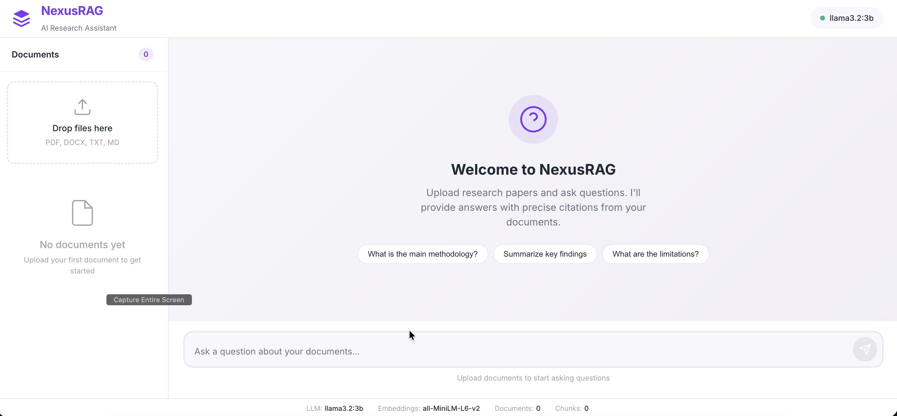
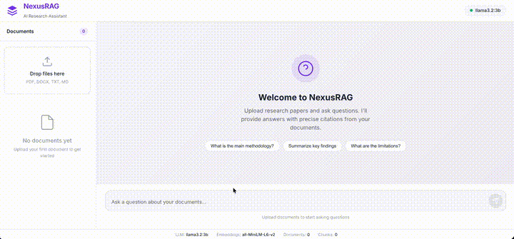

# NexusRAG

Self-correcting RAG for scientific research with precise source citations.



## Demo

[](https://github.com/urme-b/NexusRAG/raw/main/screenshots/nexusrag-demo.mov)

*Click the preview above to watch the full demo video.*

## What It Does

- **Reduces hallucinations** by validating retrieval quality before answering
- **Cites every claim** with exact passages and page numbers
- **Runs 100% locally** using Ollama—your data never leaves your machine
- **Synthesizes across papers** to answer complex research questions

## Quick Start

```bash
# Clone
git clone https://github.com/urme-b/NexusRAG.git
cd NexusRAG

# Install
python -m venv .venv && source .venv/bin/activate
pip install -e .

# Run Ollama (separate terminal)
ollama serve
ollama pull llama3.2:3b

# Start app
make run
# Open http://localhost:8000
```

## Requirements

- Python 3.11+
- 8GB RAM minimum
- [Ollama](https://ollama.ai/) installed

## Model Options

| Model | Size | RAM Needed | Speed | Quality | Best For |
|-------|------|------------|-------|---------|----------|
| llama3.2:3b | 2 GB | 8 GB | Fast | Good | Low-RAM systems, quick answers |
| llama3.1:8b | 4.9 GB | 16 GB | Slower | Better | Detailed analysis, complex queries |

**Default:** llama3.2:3b (optimized for 8GB RAM)

**To switch models:** Edit `.env` file:
```bash
LLM_MODEL=llama3.1:8b
```

## Tech Stack

Python, FastAPI, LanceDB, Ollama, Sentence Transformers

## Future Work

- [ ] **Reduce query latency** — Current end-to-end response time is ~30-45 seconds due to multiple sequential LLM calls (query planning, retrieval verification, synthesis, answer verification). Planned optimizations include parallelizing independent pipeline stages, caching frequent query patterns, and exploring smaller distilled models for intermediate steps.
- [ ] **Multi-modal document support** — Extend ingestion to handle tables, figures, and images within research papers using vision models, enabling richer retrieval and citation of non-text content.
- [ ] **Collaborative knowledge bases** — Add multi-user support with shared and private document collections, access controls, and the ability to build team-wide research knowledge bases.
