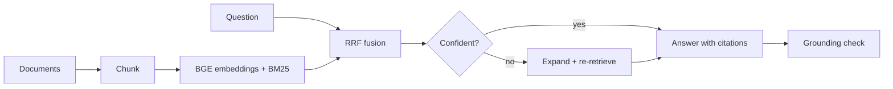

# NexusRAG

Ask questions across your research papers and get answers with citations you can check. NexusRAG runs entirely on your machine and ships with a reproducible benchmark, so every retrieval claim is measured against ground truth rather than asserted.


Most local RAG tools bundle a hybrid retriever, a reranker, and a "verifier," but never report numbers — so it is impossible to know which parts actually help. NexusRAG is built around the measurement: a strictly-additive ablation on two BEIR benchmarks with bootstrap confidence intervals and paired randomization tests, plus a faithfulness verifier evaluated as a real evidence detector.

## What the benchmark shows

Retrieval quality on SciFact (300 claims, 5,183 abstracts) and NFCorpus (323 queries, 3,633 documents), CPU-only, exact search.

| System | SciFact nDCG@10 | NFCorpus nDCG@10 |
|--------|-----------------|------------------|
| BM25 | 0.666 | 0.311 |
| Dense (MiniLM, the usual default) | 0.648 | 0.319 |
| Dense (BGE-small) | **0.708** | 0.340 |
| Hybrid (RRF) | 0.704 | **0.353** |
| + Corrective PRF | 0.703 | 0.349 |

The single biggest lever is the embedding model: swapping the common `all-MiniLM-L6-v2` for `bge-small-en-v1.5` moves dense retrieval from *below* BM25 to clearly above it (+0.060 nDCG@10 on SciFact, paired randomization p < 0.001). Reciprocal-rank fusion then beats BM25 on both corpora (SciFact p = 0.002, NFCorpus p = 0.0001) and is the best single system on NFCorpus. The confidence-gated corrective loop re-retrieves only on low-confidence queries; it is roughly neutral on nDCG here but far cheaper than a cross-encoder reranker — see the cost/quality table in [paper/main.pdf](paper/main.pdf). All numbers are generated from committed results.

## How it works


```mermaid
flowchart LR
    D[Documents] --> C[Chunk] --> E[BGE embeddings + BM25]
    Q[Question] --> R[RRF fusion]
    E --> R
    R --> G{Confident?}
    G -- yes --> S[Answer with citations]
    G -- no --> P[Expand + re-retrieve] --> S
    S --> V[Grounding check]
```

Documents are parsed, chunked, embedded into LanceDB, and indexed for BM25. A query fuses dense and lexical results with reciprocal rank fusion; if the top dense score is weak, a pseudo-relevance-feedback pass expands the query and re-retrieves. A local model answers using only the retrieved passages, with inline citations, and an NLI model checks that each answer sentence is entailed by its sources.

## Getting started

```bash
python -m venv .venv && source .venv/bin/activate
pip install -e ".[eval]"
make run            # web UI at http://localhost:8000 (needs a local Ollama for generation)
```

Reproduce the benchmark on CPU. Each command downloads its datasets and small models from Hugging Face on first run, then caches them:

```bash
make eval           # SciFact + NFCorpus ablation (downloads BGE-small)
make faithfulness   # evidence detection (downloads the NLI + reranker models)
make paper          # regenerate tables, figures, and the PDF (needs `tectonic`)
```

`make eval-sample` runs a small vendored subset with no dataset download. Building the PDF needs the [tectonic](https://tectonic-typesetting.github.io) LaTeX engine; the tables and figures are regenerated by `python -m nexusrag.eval.report` without it.

## Tech stack

| Area | Tools |
|------|-------|
| Language | Python 3.11+, typed, mypy strict |
| Retrieval | sentence-transformers (BGE-small), rank-bm25, RRF, cross-encoder reranker, DeBERTa NLI, LanceDB |
| Serving | FastAPI, Uvicorn, Ollama |
| Evaluation | SciFact, NFCorpus (BEIR), bootstrap CIs, paired randomization tests, Holm correction |
| Quality | pytest, ruff, mypy, GitHub Actions, Docker |

## License

[MIT](LICENSE)
