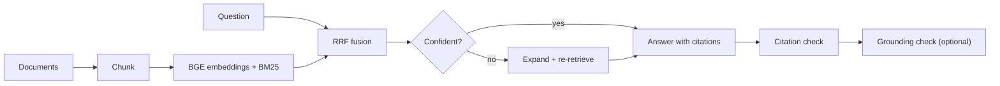

# NexusRAG

[](https://github.com/urme-b/NexusRAG/actions/workflows/ci.yml)
[](LICENSE)
[](pyproject.toml)

Ask questions across your research papers and get answers with citations you can check. NexusRAG runs entirely on your machine and ships with a reproducible benchmark, so every retrieval claim is measured against ground truth rather than asserted.


Most local RAG tools bundle a hybrid retriever, a reranker, and a "verifier," but never report numbers — so it is impossible to know which parts actually help. NexusRAG is built around the measurement: a strictly-additive ablation on two BEIR benchmarks with bootstrap confidence intervals and paired randomization tests, plus a faithfulness verifier evaluated as a real evidence detector.

## What the benchmark shows

Retrieval quality on SciFact (300 claims, 5,183 abstracts) and NFCorpus (323 queries, 3,633 documents), CPU-only, exact search.

| System | SciFact nDCG@10 | NFCorpus nDCG@10 |
|--------|-----------------|------------------|
| BM25 | 0.666 | 0.312 |
| Dense (MiniLM, the usual default) | 0.648 | 0.319 |
| Dense (BGE-small) | **0.708** | 0.342 |
| Hybrid (RRF) | 0.704 | **0.352** |
| + Corrective PRF | 0.703 | 0.346 |

The single biggest lever is the embedding model: swapping the common `all-MiniLM-L6-v2` for `bge-small-en-v1.5` moves dense retrieval from *below* BM25 to clearly above it (+0.060 nDCG@10 on SciFact, paired randomization p < 0.001). Reciprocal-rank fusion then beats BM25 by **+0.037 [+0.014, +0.061]** on SciFact and **+0.040 [+0.025, +0.055]** on NFCorpus — the 95% bootstrap CI of the paired per-query difference excludes zero in both cases, so the win is real but modest. The confidence-gated corrective loop runs a single re-retrieval pass only on low-confidence queries and is roughly neutral on nDCG here. A cross-encoder reranker was also evaluated and **does not help** on these abstract-level corpora: on a 120-query timing subset it lowers nDCG@10 (0.702 vs 0.734) and Recall@20 (0.886 vs 0.900) at ~67× the latency — reported as-is.

nDCG@10 uses graded relevance (the BEIR/`pytrec_eval` convention), RRF k = 60, the corrective threshold is selected on a held-out split, all bootstrap and randomization tests use seed 0, dense retrieval is exact, BEIR dataset revisions are pinned, and every number is generated from committed results in [`benchmarks/results/`](benchmarks/results). Full per-metric tables with CIs and p-values are in [paper/main.pdf](paper/main.pdf).

## How it works


```mermaid
flowchart LR
    D[Documents] --> C[Chunk] --> E[BGE embeddings + BM25]
    Q[Question] --> R[RRF fusion]
    E --> R
    R --> G{Confident?}
    G -- yes --> S[Answer with citations]
    G -- no --> P[Expand + re-retrieve] --> S
    S --> CC[Citation check] --> V["Grounding check (optional)"]
```

Documents are parsed, chunked, embedded into LanceDB, and indexed for BM25. A query fuses dense and lexical results with reciprocal rank fusion; if the top dense score is weak, a pseudo-relevance-feedback pass expands the query and re-retrieves. A local model answers using only the retrieved passages, with inline citations; an optional NLI grounding check (off by default) can verify that each answer sentence is entailed by its sources.

## Getting started

```bash
python -m venv .venv && source .venv/bin/activate
pip install -e ".[eval]"
make run            # web UI at http://localhost:8000 (needs a local Ollama for generation)
```

Use it as a library — the public API is `NexusRAG` plus `Settings`/`get_settings` (re-exported from the top-level package):

```python
from nexusrag import NexusRAG

rag = NexusRAG()
rag.ingest("paper.pdf")
answer = rag.query("What did the paper find?")   # answer.answer, answer.sources, answer.confidence
```

Reproduce the benchmark on CPU. Each command downloads its datasets and small models from Hugging Face on first run, then caches them:

```bash
make eval           # SciFact + NFCorpus ablation (downloads BGE-small)
make faithfulness   # evidence detection (downloads the NLI + reranker models)
make paper          # regenerate tables, figures, and the PDF (needs `tectonic`)
```

One command regenerates every number in the table above from scratch, with pinned environments (`requirements.lock`, `requirements-runtime.lock`) and seed 0 throughout:

```bash
make reproduce      # == python -m nexusrag.eval
```

It reruns both datasets (BGE-small and the MiniLM baseline), the corrective-loop tau selection, and evidence detection, rewriting [`benchmarks/results/`](benchmarks/results). The raw per-query nDCG@10 for every system is committed alongside the JSON as CSV ([`scifact_test_per_query.csv`](benchmarks/results/scifact_test_per_query.csv), [`nfcorpus_test_per_query.csv`](benchmarks/results/nfcorpus_test_per_query.csv)), so each headline mean can be recomputed row by row. `make eval-sample` runs a small vendored subset with no dataset download. Building the PDF needs the [tectonic](https://tectonic-typesetting.github.io) LaTeX engine; the tables and figures are regenerated by `python -m nexusrag.eval.report` without it.

## Evals in CI

Retrieval and faithfulness quality are guarded by a CI job, not just asserted in the README. On every push, `python -m nexusrag.eval.gate` reruns the vendored offline sample (50 SciFact queries / 651 abstracts and 60 SciFact claims, seed 0, CPU, no downloads of the large corpora) and **fails the build if any tracked metric drops below a committed floor** in [`benchmarks/thresholds.json`](benchmarks/thresholds.json). The sample is deterministic to the printed digits across runs; floors are the current values minus a small tolerance so a genuine regression trips the gate while cross-version float noise does not.

Current sample values (floors sit 0.01 below the retrieval rows and 0.015 below the faithfulness rows):

| Metric | Sample value | Floor |
|--------|--------------|-------|
| Retrieval nDCG@10 — Hybrid (RRF) | 0.910 | 0.900 |
| Retrieval nDCG@10 — + Corrective PRF | 0.899 | 0.889 |
| Retrieval Recall@10 (both) | 0.980 | 0.970 |
| Faithfulness ROC-AUC — NLI | 0.752 | 0.737 |
| Faithfulness ROC-AUC — cross-encoder | 0.774 | 0.759 |

These are the small vendored sample, not the headline table above — they exist to catch regressions cheaply on CPU, not to restate the full-corpus results. Update the floors deliberately when a real improvement lands.

## Reproducibility and limitations

The full ablation is CPU-only and runs in roughly 15–25 min per dataset on a modern laptop (embedding 3.6k–5.2k abstracts with BGE-small, exact search). Models cache locally on first run: BGE-small ~130 MB, cross-encoder ~90 MB, DeBERTa-NLI ~280 MB, plus `llama3.2:3b` ~2 GB via Ollama for generation — about 8 GB RAM to run the full stack. Design and component-level limitations are documented in [docs/ARCHITECTURE.md](docs/ARCHITECTURE.md); the exact source, pinned revision, and license of every model and corpus are catalogued in [PROVENANCE.md](PROVENANCE.md).

Scope is deliberately narrow: two abstract-level BEIR datasets (the 300-query SciFact set is BEIR's maximum). Broader datasets (FiQA, SciDocs), domain encoders (SPECTER2, SciNCL), additional neural baselines (SPLADE, ColBERTv2, monoT5), full-paper chunking ablations, and end-to-end answer-quality scoring (RAGAs / LLM-as-judge) are future work, not claimed here. The `frontend/` directory is an optional static UI served by FastAPI for local use; it is not needed for the benchmark or API.

## Tech stack

| Area | Tools |
|------|-------|
| Language | Python 3.11–3.12, typed, mypy strict |
| Retrieval | sentence-transformers (BGE-small), rank-bm25, RRF (k=60), cross-encoder reranker, DeBERTa NLI, LanceDB (cosine, exact) |
| Serving | FastAPI, Uvicorn, Ollama (`llama3.2:3b`, pinned) |
| Evaluation | SciFact, NFCorpus (BEIR, revisions pinned), bootstrap CIs, paired randomization + delta CIs, Holm correction |
| Quality | pytest (299 tests, 65% branch coverage), ruff, mypy (strict), GitHub Actions CI, gitleaks, pip-audit, Docker |

## Citation

If you use NexusRAG, please cite it (metadata in [CITATION.cff](CITATION.cff)):

```bibtex
@software{bose_nexusrag_2026,
  author  = {Bose, Urme},
  title   = {NexusRAG: Local Hybrid Retrieval and Faithfulness Evaluation for Scientific Papers},
  year    = {2026},
  version = {1.0.1},
  url     = {https://github.com/urme-b/NexusRAG}
}
```

## License

The code is [MIT](LICENSE). The models it downloads keep their own licenses — notably the default generator (`llama3.2:3b`) is under the Llama 3.2 Community License, which is not OSI-approved and carries an acceptable-use policy. [PROVENANCE.md](PROVENANCE.md) lists the exact license of every model and corpus.
