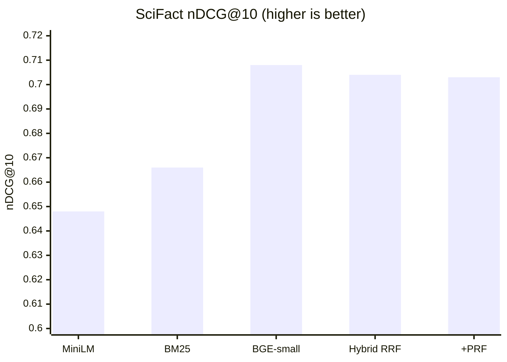
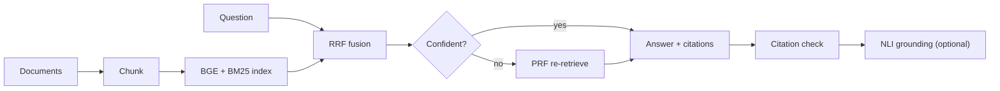

# NexusRAG: Local Hybrid Retrieval and Faithfulness Evaluation for Scientific Papers

**Which parts of a local RAG stack actually improve retrieval?** **Mostly the embedding model: swapping MiniLM for BGE-small lifts dense retrieval from below BM25 to well above it, fusion adds a small provable gain, and the cross-encoder reranker makes results worse at 67x the latency.**


Ask questions across your research papers and get answers with citations you can check. Everything runs on your machine, and every design choice is measured on public benchmarks:

- Measured, not asserted: each component ablated on two BEIR datasets with bootstrap CIs and paired randomization tests
- Reproducible to the digit: one command regenerates every number at seed 0; raw per-query CSVs are committed
- CI quality gate: the build fails if any tracked metric drops below its committed floor
- Honest results: the reranker made things worse, so it is reported and kept out of the default path
- Fully local: papers never leave your machine; generation runs on Ollama

## Results

Retrieval on SciFact (300 claims, 5,183 abstracts) and NFCorpus (323 queries, 3,633 documents). CPU only, exact search, seed 0.

| System | SciFact nDCG@10 | NFCorpus nDCG@10 |
|--------|:---:|:---:|
| Dense, MiniLM (the common default) | 0.648 | 0.319 |
| BM25 | 0.666 | 0.312 |
| Dense, BGE-small | **0.708** | 0.342 |
| Hybrid (RRF) | 0.704 | **0.352** |
| + Corrective PRF | 0.703 | 0.346 |


```mermaid
xychart-beta
    title "SciFact nDCG@10 (higher is better)"
    x-axis ["MiniLM", "BM25", "BGE-small", "Hybrid RRF", "+PRF"]
    y-axis "nDCG@10" 0.60 --> 0.72
    bar [0.648, 0.666, 0.708, 0.704, 0.703]
```

Evidence detection on SciFact claims (188 dev claims, 2,031 candidate sentences), claim-bootstrap 95% CIs:

| Scorer | ROC-AUC | 95% CI |
|--------|:---:|:---:|
| Cross-encoder | **0.755** | [0.721, 0.793] |
| NLI (DeBERTa) | 0.688 | [0.652, 0.726] |
| Lexical overlap | 0.686 | [0.652, 0.720] |

Three findings, reported as measured:

- The embedding model is the biggest lever: replacing `all-MiniLM-L6-v2` with `bge-small-en-v1.5` lifts dense retrieval from below BM25 to +0.060 nDCG@10 above it (p < 0.001)
- Hybrid fusion wins, modestly but provably: RRF beats BM25 by +0.037 [+0.014, +0.061] on SciFact and +0.040 [+0.025, +0.055] on NFCorpus; both CIs exclude zero
- The reranker hurts here: lower nDCG@10 (0.702 vs 0.734), lower Recall@20, at roughly 67x the latency; the corrective loop is neutral on these corpora

## Parameters

| Parameter | Value |
|-----------|-------|
| Datasets | SciFact and NFCorpus (BEIR, git revisions pinned) |
| Relevance | Graded nDCG@10 (pytrec_eval convention); binary Recall, MRR, MAP |
| Fusion | RRF, k = 60 |
| Retrieval depth | 50, exact search (no ANN index) |
| Corrective threshold | Tau selected on a held-out split |
| Statistics | Bootstrap CIs and paired randomization, 10,000 resamples, seed 0 |
| Models | Every HF model pinned to an exact revision (one map in config) |

Every number above regenerates from committed results in [benchmarks/results](benchmarks/results). Per-query nDCG@10 is committed as CSV ([scifact](benchmarks/results/scifact_test_per_query.csv), [nfcorpus](benchmarks/results/nfcorpus_test_per_query.csv)) so each mean can be recomputed row by row. Full tables with CIs and p-values: [paper/main.pdf](paper/main.pdf).

## Method


```mermaid
flowchart LR
    D[Documents] --> C[Chunk] --> E[BGE + BM25 index]
    Q[Question] --> R[RRF fusion]
    E --> R
    R --> G{Confident?}
    G -- yes --> S[Answer + citations]
    G -- no --> P[PRF re-retrieve] --> S
    S --> CC[Citation check] --> V["NLI grounding (optional)"]
```

- Ingest: parse PDF/DOCX/MD/TXT, chunk section-aware with overlap, embed into LanceDB, index for BM25
- Retrieve: fuse dense and lexical rankings with reciprocal rank fusion
- Correct: if top dense confidence is weak, one pseudo-relevance-feedback pass expands the query and re-retrieves
- Answer: a local model writes from retrieved passages only, with inline citations; invalid citations are stripped and reported
- Verify: an optional NLI check tests that each answer sentence is entailed by its cited sources

On every push, CI reruns a deterministic vendored sample (50 queries, 651 abstracts, 60 claims, CPU, no large downloads) and fails the build if any metric drops below its floor in [benchmarks/thresholds.json](benchmarks/thresholds.json):

| Metric | Sample value | Floor |
|--------|:---:|:---:|
| nDCG@10, Hybrid (RRF) | 0.910 | 0.900 |
| nDCG@10, + Corrective PRF | 0.899 | 0.889 |
| Recall@10 (both) | 0.980 | 0.970 |
| Faithfulness ROC-AUC, NLI | 0.752 | 0.737 |
| Faithfulness ROC-AUC, cross-encoder | 0.774 | 0.759 |

The same CI runs gitleaks, pip-audit against hash-pinned lockfiles, ruff, strict mypy, and the full test suite on Python 3.11 and 3.12.

## Core ideas in 30 seconds

| Term | Meaning here |
|------|--------------|
| RAG | Retrieve relevant passages first, then generate an answer from them |
| Hybrid retrieval | Combine dense embeddings (meaning) with BM25 (exact words) |
| RRF | Reciprocal rank fusion: merges the two rankings without score calibration |
| Corrective PRF | If confidence is low, expand the query with top terms and retrieve again |
| NLI grounding | A natural language inference model checks each sentence against its sources |

## Toolkit

```bash
python -m venv .venv && source .venv/bin/activate
pip install -e ".[eval]"
make run    # web UI at http://localhost:8000 (needs local Ollama)
```

```python
from nexusrag import NexusRAG

rag = NexusRAG()
rag.ingest("paper.pdf")
result = rag.query("What did the paper find?")
# result.answer, result.sources, result.confidence
```

Docker: `docker compose up` starts the API plus a pinned Ollama service. See [examples](examples) and [notebooks/01_quickstart.ipynb](notebooks/01_quickstart.ipynb).

| Command | What it does |
|---------|--------------|
| make reproduce | Regenerates every number above from scratch, pinned env, seed 0 |
| make eval | SciFact + NFCorpus ablation (downloads BGE-small once) |
| make faithfulness | Evidence detection eval (NLI + cross-encoder) |
| make eval-sample | Vendored subset, no downloads, runs in minutes |
| make paper | Rebuilds tables, figures, and the PDF (needs tectonic) |

| Footprint | Size |
|-----------|------|
| BGE-small embedder | ~130 MB |
| Cross-encoder reranker | ~90 MB |
| DeBERTa NLI | ~280 MB |
| llama3.2:3b (Ollama) | ~2 GB |
| RAM for full stack | ~8 GB |
| Full ablation runtime | 15 to 25 min per dataset, laptop CPU |

## Applications

| Use case | How |
|----------|-----|
| Ask questions over your own papers | Web UI or the NexusRAG Python API, fully local |
| Benchmark a retrieval change | make reproduce, then diff against committed results |
| Evaluate a faithfulness scorer | make faithfulness scores it as an evidence detector |
| Gate RAG quality in CI | python -m nexusrag.eval.gate with committed floors |

## Limitations

- Two abstract-level BEIR datasets only; the 300-query SciFact set is BEIR's maximum
- Exact dense search, no ANN index; fine at this scale, not tuned for millions of chunks
- BM25 index lives in memory and rebuilds on cold start
- Corrective PRF is roughly neutral on nDCG here; kept because it is cheap and helps recall on hard queries
- Broader datasets, domain encoders (SPECTER2, SciNCL), and neural baselines (SPLADE, ColBERTv2) are not claimed here

## Tech Stack

| Area | Tools |
|------|-------|
| Retrieval | sentence-transformers (BGE-small, pinned revision), rank-bm25, RRF (k=60), LanceDB (cosine, exact) |
| Verification | citation validation, DeBERTa NLI sentence grounding |
| Serving | FastAPI, Uvicorn, Ollama (llama3.2:3b, pinned) |
| Evaluation | BEIR (SciFact, NFCorpus, pinned revisions), bootstrap CIs, paired randomization, Holm correction |
| Quality | pytest (303 tests, 65% branch coverage), mypy strict, ruff, gitleaks, pip-audit, Docker (non-root, hash-pinned deps) |

## Docs

| Doc | Purpose |
|-----|---------|
| [docs/ARCHITECTURE.md](docs/ARCHITECTURE.md) | Design decisions and component-level limitations |
| [PROVENANCE.md](PROVENANCE.md) | Source, pinned revision, and license of every model and corpus |
| [CONTRIBUTING.md](CONTRIBUTING.md) | Local setup, checks, how to reproduce the benchmark |
| [SECURITY.md](SECURITY.md) | Threat model and private vulnerability reporting |
| [CHANGELOG.md](CHANGELOG.md) | Release history |
| [paper/main.pdf](paper/main.pdf) | The full study: per-metric tables, CIs, p-values |

## References

- [BEIR](https://arxiv.org/abs/2104.08663): benchmark suite and dataset format used for both retrieval corpora.
- [SciFact](https://arxiv.org/abs/2004.14974): claim-verification dataset; also supplies the evidence-sentence labels for the faithfulness eval.
- [C-Pack / BGE](https://arxiv.org/abs/2309.07597): the bge-small-en-v1.5 embedder behind the headline gain.
- Cormack, Clarke and Buettcher, SIGIR 2009: reciprocal rank fusion, the hybrid combiner used here.
- Robertson and Zaragoza, 2009: BM25, the lexical baseline every system is measured against.
- [MiniLM](https://arxiv.org/abs/2002.10957): the default embedder most local RAG stacks ship; the ablation's starting point.
- [Self-RAG](https://arxiv.org/abs/2310.11511) and [CRAG](https://arxiv.org/abs/2401.15884): corrective-retrieval ideas the confidence-gated loop distills to a minimal form.

## License

Code is [MIT](LICENSE). Downloaded models keep their own licenses: the default generator llama3.2:3b is under the Llama 3.2 Community License, which is not OSI-approved and carries an acceptable-use policy. Full catalogue: [PROVENANCE.md](PROVENANCE.md).
