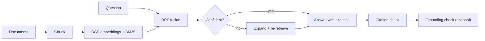

# NexusRAG: Local Hybrid Retrieval and Faithfulness Evaluation for Scientific Papers

**Which parts of a local RAG stack actually improve retrieval?** **Mostly the embedding model: swapping MiniLM for BGE-small lifts dense retrieval from below BM25 to well above it, fusion adds a small significant gain, and the cross-encoder reranker makes results worse at 67x the latency.**


Ask questions across your research papers and get answers with citations you can check. NexusRAG runs entirely on your machine and ships with a reproducible benchmark: every retrieval claim is measured against ground truth on two BEIR datasets, with bootstrap confidence intervals and paired randomization tests.

## Results

Retrieval quality on SciFact (300 claims, 5,183 abstracts) and NFCorpus (323 queries, 3,633 documents), CPU-only, exact search.

| System | SciFact nDCG@10 | NFCorpus nDCG@10 |
|--------|-----------------|------------------|
| BM25 | 0.666 | 0.312 |
| Dense (MiniLM, the usual default) | 0.648 | 0.319 |
| Dense (BGE-small) | **0.708** | 0.342 |
| Hybrid (RRF) | 0.704 | **0.352** |
| + Corrective PRF | 0.703 | 0.346 |

Evidence detection on SciFact claims (188 dev claims, 2,031 candidate sentences), claim-bootstrap 95% CIs:

| Scorer | ROC-AUC | 95% CI |
|--------|---------|--------|
| Cross-encoder | **0.755** | [0.721, 0.793] |
| NLI (DeBERTa) | 0.688 | [0.652, 0.726] |
| Lexical overlap | 0.686 | [0.652, 0.720] |

Three findings, reported as measured:

- The embedding model is the lever: BGE-small moves dense retrieval from below BM25 to +0.060 nDCG@10 above it on SciFact (paired randomization p < 0.001).
- Fusion helps a little: RRF beats BM25 by +0.037 [+0.014, +0.061] on SciFact and +0.040 [+0.025, +0.055] on NFCorpus; both CIs exclude zero.
- The reranker hurts: it lowers nDCG@10 (0.702 vs 0.734) and Recall@20 (0.886 vs 0.900) at roughly 67x the latency on a 120-query timing subset. The corrective loop is neutral on these corpora.


## Parameters

| Parameter | Value |
|-----------|-------|
| Datasets | SciFact and NFCorpus (BEIR, git revisions pinned) |
| Relevance | Graded nDCG@10 (pytrec_eval convention); binary Recall, MRR, MAP |
| Fusion | RRF, k = 60 |
| Retrieval depth | 50, exact search (no ANN index) |
| Corrective threshold | Tau selected on a held-out split |
| Statistics | Bootstrap CIs and paired randomization, 10,000 resamples, seed 0 |

Every number above regenerates from committed results in [benchmarks/results](benchmarks/results). Per-query nDCG@10 is committed as CSV ([scifact](benchmarks/results/scifact_test_per_query.csv), [nfcorpus](benchmarks/results/nfcorpus_test_per_query.csv)) so each mean can be recomputed row by row. Full tables with CIs and p-values are in [paper/main.pdf](paper/main.pdf).

## Method


```mermaid
flowchart LR
    D[Documents] --> C[Chunk] --> E[BGE embeddings + BM25]
    Q[Question] --> R[RRF fusion]
    E --> R
    R --> G{Confident?}
    G -- yes --> S[Answer with citations]
    G -- no --> P[Expand + re-retrieve] --> S
    S --> CC[Citation check] --> V["Grounding check (optional)"]
```

Documents are parsed, chunked, embedded into LanceDB, and indexed for BM25. A query fuses dense and lexical results with reciprocal rank fusion; if the top dense score is weak, a pseudo-relevance-feedback pass expands the query and re-retrieves. A local model answers using only the retrieved passages, with inline citations; an optional NLI grounding check (off by default) verifies that each answer sentence is entailed by its sources.

On every push, CI reruns a vendored offline sample (50 SciFact queries, 651 abstracts, 60 claims, seed 0, CPU) and fails the build if any tracked metric drops below its committed floor in [benchmarks/thresholds.json](benchmarks/thresholds.json):

| Metric | Sample value | Floor |
|--------|--------------|-------|
| nDCG@10: Hybrid (RRF) | 0.910 | 0.900 |
| nDCG@10: + Corrective PRF | 0.899 | 0.889 |
| Recall@10 (both) | 0.980 | 0.970 |
| ROC-AUC: NLI | 0.752 | 0.737 |
| ROC-AUC: cross-encoder | 0.774 | 0.759 |

## Toolkit

```bash
python -m venv .venv && source .venv/bin/activate
pip install -e ".[eval]"
make run            # web UI at http://localhost:8000 (needs a local Ollama)
```

```python
from nexusrag import NexusRAG

rag = NexusRAG()
rag.ingest("paper.pdf")
answer = rag.query("What did the paper find?")   # answer.answer, answer.sources, answer.confidence
```

| Command | What it does |
|---------|--------------|
| make eval | SciFact + NFCorpus ablation (downloads BGE-small on first run) |
| make faithfulness | Evidence detection (downloads the NLI and reranker models) |
| make reproduce | Regenerates every number above from scratch, seed 0, pinned environments |
| make eval-sample | Small vendored subset, no downloads |
| make paper | Regenerates tables, figures, and the PDF (needs tectonic) |

The full ablation is CPU-only, roughly 15 to 25 minutes per dataset on a modern laptop. About 8 GB RAM runs the whole stack: BGE-small ~130 MB, cross-encoder ~90 MB, DeBERTa-NLI ~280 MB, llama3.2:3b ~2 GB via Ollama. Scope is deliberately narrow: two abstract-level BEIR datasets, no SPLADE/ColBERT/monoT5 baselines, no end-to-end answer scoring.

## Applications

| Use case | How |
|----------|-----|
| Ask questions over your own papers | Web UI or the NexusRAG Python API, fully local |
| Benchmark a retrieval change | make reproduce, then diff against committed results |
| Evaluate a faithfulness scorer | make faithfulness scores it as an evidence detector |
| Gate RAG quality in CI | python -m nexusrag.eval.gate with committed floors |

## Tech Stack

| Area | Tools |
|------|-------|
| Language | Python 3.11 to 3.12, typed, mypy strict |
| Retrieval | sentence-transformers (BGE-small), rank-bm25, RRF (k=60), cross-encoder reranker, DeBERTa NLI, LanceDB (cosine, exact) |
| Serving | FastAPI, Uvicorn, Ollama (llama3.2:3b, pinned) |
| Evaluation | SciFact, NFCorpus (BEIR, revisions pinned), bootstrap CIs, paired randomization + delta CIs, Holm correction |
| Quality | pytest (302 tests, 65% branch coverage), ruff, mypy strict, GitHub Actions, gitleaks, pip-audit, Docker |

## Docs

- [docs/ARCHITECTURE.md](docs/ARCHITECTURE.md): design decisions and component-level limitations
- [PROVENANCE.md](PROVENANCE.md): source, pinned revision, and license of every model and corpus
- [SECURITY.md](SECURITY.md): threat model and the controls enforced in code
- [paper/main.pdf](paper/main.pdf): the full study with per-metric tables, CIs, and p-values

## References

- [BEIR](https://arxiv.org/abs/2104.08663): benchmark suite and dataset format used for both retrieval corpora.
- [SciFact](https://arxiv.org/abs/2004.14974): claim-verification dataset; also supplies the evidence-sentence labels for the faithfulness eval.
- [C-Pack / BGE](https://arxiv.org/abs/2309.07597): the bge-small-en-v1.5 embedder behind the headline gain.
- Cormack, Clarke and Buettcher, SIGIR 2009: reciprocal rank fusion, the hybrid combiner used here.
- Robertson and Zaragoza, 2009: BM25, the lexical baseline every system is measured against.
- [MiniLM](https://arxiv.org/abs/2002.10957): the default embedder most local RAG stacks ship; the ablation's starting point.
- [Self-RAG](https://arxiv.org/abs/2310.11511) and [CRAG](https://arxiv.org/abs/2401.15884): corrective-retrieval ideas the confidence-gated loop distills to a minimal form.

## License

Code is [MIT](LICENSE). Downloaded models keep their own licenses: the default generator llama3.2:3b is under the Llama 3.2 Community License, which is not OSI-approved and carries an acceptable-use policy. [PROVENANCE.md](PROVENANCE.md) lists every model and corpus license.
