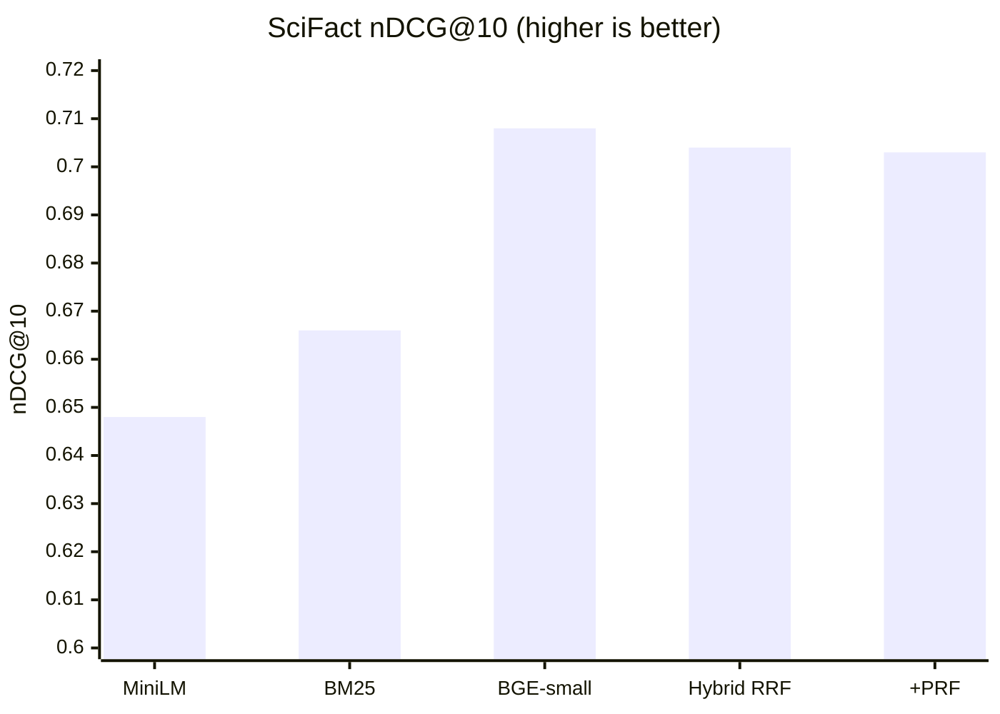
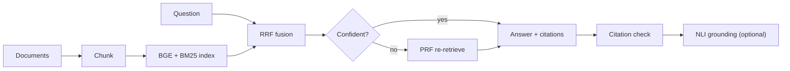

# NexusRAG

[](https://github.com/urme-b/NexusRAG/actions/workflows/ci.yml)
[](LICENSE)
[](pyproject.toml)
[](tests/)
[](tests/)
[](pyproject.toml)

Local retrieval augmented generation (RAG) for research papers. Ask questions across your PDFs, get answers with citations you can check. Every design choice is measured on public benchmarks, and CI fails the build if quality drops.


## Highlights

- **Measured, not asserted**: every component ablated on two BEIR datasets with bootstrap confidence intervals and paired randomization tests
- **Reproducible to the digit**: one command regenerates every number from scratch at seed 0, raw per-query CSVs committed
- **CI quality gate**: builds fail if any tracked metric drops below a committed floor
- **Honest results**: the reranker made things worse, so it is reported and kept out of the default path
- **Fully local**: your papers never leave your machine, generation runs on Ollama

## Results

SciFact (300 claims, 5,183 abstracts) and NFCorpus (323 queries, 3,633 documents). CPU only, exact search, seed 0.

| System | SciFact nDCG@10 | NFCorpus nDCG@10 |
|--------|:---:|:---:|
| Dense, MiniLM (the common default) | 0.648 | 0.319 |
| BM25 | 0.666 | 0.312 |
| Dense, BGE-small | **0.708** | 0.342 |
| Hybrid (RRF) | 0.704 | **0.352** |
| + Corrective PRF | 0.703 | 0.346 |


```mermaid
xychart-beta
    title "SciFact nDCG@10 (higher is better)"
    x-axis ["MiniLM", "BM25", "BGE-small", "Hybrid RRF", "+PRF"]
    y-axis "nDCG@10" 0.60 --> 0.72
    bar [0.648, 0.666, 0.708, 0.704, 0.703]
```

Three findings:

- **The embedding model is the biggest lever.** Swapping the common `all-MiniLM-L6-v2` for `bge-small-en-v1.5` lifts dense retrieval from below BM25 to clearly above it (+0.060 nDCG@10, p < 0.001)
- **Hybrid fusion wins, modestly but provably.** RRF beats BM25 by +0.037 [+0.014, +0.061] on SciFact and +0.040 [+0.025, +0.055] on NFCorpus. Both 95% CIs exclude zero
- **The cross-encoder reranker hurts here.** Lower nDCG@10 (0.702 vs 0.734), lower Recall@20, at ~67x the latency on these abstract-level corpora

Full tables with CIs and p-values: [paper/main.pdf](paper/main.pdf). Raw per-query scores: [`benchmarks/results/`](benchmarks/results).

## Pipeline


```mermaid
flowchart LR
    D[Documents] --> C[Chunk] --> E[BGE + BM25 index]
    Q[Question] --> R[RRF fusion]
    E --> R
    R --> G{Confident?}
    G -- yes --> S[Answer + citations]
    G -- no --> P[PRF re-retrieve] --> S
    S --> CC[Citation check] --> V["NLI grounding (optional)"]
```

- **Ingest**: parse PDF/DOCX/MD/TXT, chunk section-aware with overlap, embed into LanceDB, index for BM25
- **Retrieve**: fuse dense and lexical rankings with reciprocal rank fusion (k = 60)
- **Correct**: if top dense confidence is weak, one pseudo relevance feedback pass expands the query and re-retrieves
- **Answer**: a local model writes from retrieved passages only, with inline citations; invalid citations are stripped
- **Verify**: an optional NLI check tests that each answer sentence is entailed by its cited sources

## Quick start

```bash
python -m venv .venv && source .venv/bin/activate
pip install -e ".[eval]"
make run    # web UI at http://localhost:8000 (needs local Ollama)
```

As a library:

```python
from nexusrag import NexusRAG

rag = NexusRAG()
rag.ingest("paper.pdf")
result = rag.query("What did the paper find?")
# result.answer, result.sources, result.confidence
```

Docker: `docker compose up` starts the API plus a pinned Ollama service. See [`examples/`](examples) and [`notebooks/01_quickstart.ipynb`](notebooks/01_quickstart.ipynb).

## Reproduce the benchmark

| Command | What it does |
|---------|--------------|
| `make reproduce` | Regenerates every number above from scratch, pinned env, seed 0 |
| `make eval` | SciFact + NFCorpus ablation (downloads BGE-small once) |
| `make faithfulness` | Evidence detection eval (NLI + cross-encoder) |
| `make eval-sample` | Vendored subset, no downloads, runs in minutes |
| `make paper` | Rebuilds tables, figures, and the PDF (needs tectonic) |

## Quality gate in CI

On every push, [`nexusrag.eval.gate`](src/nexusrag/eval/gate.py) reruns a deterministic vendored sample (50 queries, 651 abstracts, 60 claims, CPU, no large downloads) and fails the build if any metric drops below its floor in [`benchmarks/thresholds.json`](benchmarks/thresholds.json):

| Metric | Sample value | Floor |
|--------|:---:|:---:|
| nDCG@10, Hybrid (RRF) | 0.910 | 0.900 |
| nDCG@10, + Corrective PRF | 0.899 | 0.889 |
| Recall@10 (both) | 0.980 | 0.970 |
| Faithfulness ROC-AUC, NLI | 0.752 | 0.737 |
| Faithfulness ROC-AUC, cross-encoder | 0.774 | 0.759 |

The same CI runs gitleaks, pip-audit against hash-pinned lockfiles, ruff, strict mypy, and 303 tests on Python 3.11 and 3.12.

## Core ideas in 30 seconds

| Term | Meaning here |
|------|--------------|
| RAG | Retrieve relevant passages first, then generate an answer from them |
| Hybrid retrieval | Combine dense embeddings (meaning) with BM25 (exact words) |
| RRF | Reciprocal rank fusion, merges the two rankings without score calibration |
| Corrective PRF | If confidence is low, expand the query with top terms and retrieve again |
| NLI grounding | A natural language inference model checks each sentence against its sources |

## Footprint

| Item | Size |
|------|------|
| BGE-small embedder | ~130 MB |
| Cross-encoder reranker | ~90 MB |
| DeBERTa NLI | ~280 MB |
| llama3.2:3b (Ollama) | ~2 GB |
| RAM for full stack | ~8 GB |
| Full ablation runtime | 15 to 25 min per dataset, laptop CPU |

## Limitations

- Two abstract-level BEIR datasets only; the 300-query SciFact set is BEIR's maximum
- Exact dense search, no ANN index; fine at this scale, not tuned for millions of chunks
- BM25 index lives in memory and rebuilds on cold start
- Corrective PRF is roughly neutral on nDCG here; kept because it is cheap and helps recall on hard queries
- Component-level limits: [docs/ARCHITECTURE.md](docs/ARCHITECTURE.md). Model sources, pinned revisions, licenses: [PROVENANCE.md](PROVENANCE.md)

## Roadmap

- Broader datasets: FiQA, SciDocs
- Domain encoders: SPECTER2, SciNCL
- Neural baselines: SPLADE, ColBERTv2, monoT5
- Full-paper chunking ablations
- End-to-end answer scoring: RAGAs, LLM as judge
- Persistent BM25 index and ANN search for larger corpora

## Stack

| Area | Tools |
|------|-------|
| Retrieval | sentence-transformers (BGE-small, pinned revision), rank-bm25, RRF, LanceDB (cosine, exact) |
| Verification | citation validation, DeBERTa NLI sentence grounding |
| Serving | FastAPI, Uvicorn, Ollama (llama3.2:3b) |
| Evaluation | BEIR (SciFact, NFCorpus, pinned revisions), bootstrap CIs, paired randomization, Holm correction |
| Quality | pytest, mypy strict, ruff, gitleaks, pip-audit, Docker (non-root, hash-pinned deps) |

## Project docs

| Doc | Purpose |
|-----|---------|
| [CONTRIBUTING.md](CONTRIBUTING.md) | Local setup, checks, how to reproduce the benchmark |
| [SECURITY.md](SECURITY.md) | Private vulnerability reporting |
| [CODE_OF_CONDUCT.md](CODE_OF_CONDUCT.md) | Community standards |
| [CHANGELOG.md](CHANGELOG.md) | Release history |

## License

Code is [MIT](LICENSE). Downloaded models keep their own licenses; the default generator llama3.2:3b is under the Llama 3.2 Community License, which is not OSI approved and carries an acceptable use policy. Full catalogue: [PROVENANCE.md](PROVENANCE.md).
