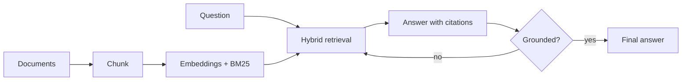

# NexusRAG

[](https://github.com/urme-b/NexusRAG/actions/workflows/ci.yml)
[](pyproject.toml)
[](LICENSE)

Ask questions across your research papers and get answers with citations you can trust. NexusRAG runs entirely on your machine, grounds every answer in the source text, and ships with a benchmark that measures how well it actually retrieves and verifies — not just a demo.


Most local RAG tools include a retriever and a "verifier" but never report numbers, and the verifier usually only checks that a citation is well-formed. NexusRAG measures retrieval and faithfulness on real benchmarks, and the verifier checks whether each sentence is genuinely entailed by its source.

## What it does

- Combines dense (MiniLM) and keyword (BM25) retrieval, fused and reranked, so it finds the right passage whether the query is technical or descriptive.
- Verifies each answer sentence against its sources with a natural-language-inference model, and re-retrieves when the grounding is weak.
- Links every claim to the exact passage and page it came from.
- Keeps documents, embeddings, and generation on your machine — no API keys, no data leaving the laptop.

## Results

Retrieval quality on SciFact (300 claims, 5,183 documents). Each step adds one component.


| System | nDCG@10 | Recall@20 |
|--------|---------|-----------|
| BM25 | 0.666 | 0.821 |
| Dense (MiniLM) | 0.648 | 0.844 |
| Hybrid (RRF) | 0.670 | 0.875 |
| Full pipeline | 0.685 | 0.870 |

The full pipeline significantly beats dense-only retrieval (paired randomization test, p = 0.031), and the same ordering holds on a second benchmark, NFCorpus. The faithfulness check locates gold evidence sentences at F1 0.370, where a citation-format check scores zero. Every number is generated from committed results and reproducible with one command; the full write-up is in [paper/main.pdf](paper/main.pdf).

## How it works


```mermaid
flowchart LR
    D[Documents] --> C[Chunk] --> E[Embeddings + BM25]
    Q[Question] --> R[Hybrid retrieval]
    E --> R
    R --> S[Answer with citations]
    S --> V{Grounded?}
    V -- yes --> A[Final answer]
    V -- no --> R
```

Documents are parsed, chunked, embedded into LanceDB, and indexed for BM25. A query is answered by fusing dense and lexical results, reranking them, generating an answer with a local model, and checking that answer against its sources before it is returned.

## Tech stack

| Area | Tools |
|------|-------|
| Language | Python 3.11, typed with mypy (strict) |
| Retrieval & ML | sentence-transformers (MiniLM), rank-bm25, cross-encoder reranker, DeBERTa NLI, LanceDB |
| Serving | FastAPI, Uvicorn, Ollama |
| Evaluation | SciFact, NFCorpus (BEIR), bootstrap CIs, paired significance tests |
| Quality | pytest (266 tests), ruff, mypy, GitHub Actions, Docker |

## Getting started

```bash
python -m venv .venv && source .venv/bin/activate
pip install -e .
make run
```

Reproduce the benchmark offline on CPU: `make eval-sample`.

## License

[MIT](LICENSE)
